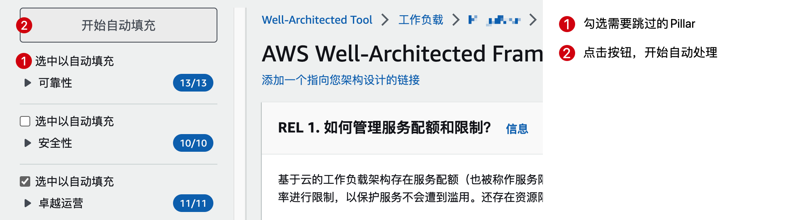

Well Architected 助手
---

自动填充WA工作负载中未涉及到的Pillar，节省时间。

使用方法：

1. 请先安装油猴插件到浏览器。
    1. MS Edge: Tampermonkey - Microsoft Edge Addons (https://microsoftedge.microsoft.com/addons/detail/tampermonkey/iikmkjmpaadaobahmlepeloendndfphd)
    2. Chrome: https://chrome.google.com/webstore/detail/tampermonkey/dhdgffkkebhmkfjojejmpbldmpobfkfo
2. 浏览器打开链接 https://raw.githubusercontent.com/Chen188/wellarchitected-helper/main/wa_helper.user.js ，并点击“Install”完成安装。
3. 打开WA控制台，https://us-east-1.console.aws.amazon.com/wellarchitected/home ，点进 工作负载 审核页面，可以看到如下界面：

   